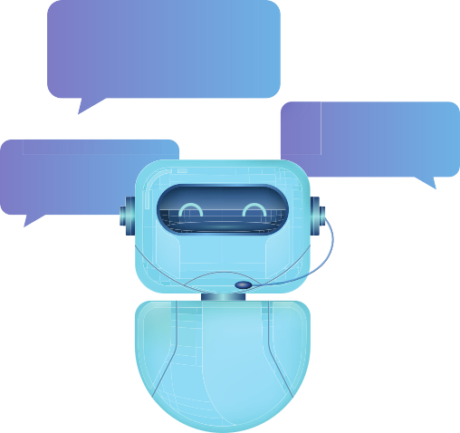

# ChatBot Ayla

> Aplcacao Python feita utilizandos modelos de predicao para simular um Bot de perguntas e respostas desenvolvido na disciplina de Tecnologias Emergentes


## Modulos

```python
nltk
random
json 
numpy 
tflearn
tensorflow
nltk.stem.rslp 
pygame
speech_recognition
gtts
```


##  Iniciar

1. Instale os modulos necessarios
2. execute o arquivo bot.py
3. Aguarde o Bot inicializar e dia "Oi"

### PYTHON  3.5^  REQUIRED

